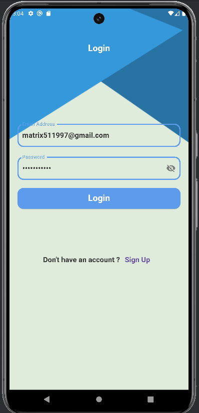
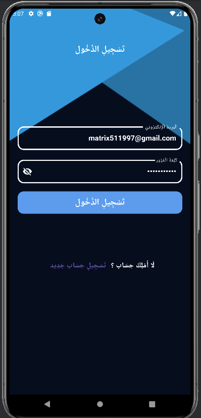

# Flutter Todo App

A simple and efficient Todo app to help users organize their tasks. The app features task creation, editing, and deletion, with options to mark tasks as complete. It supports both light and dark modes, and provides localization for Arabic and English users.

## Features

- **User Authentication**: Login and registration using Firebase Authentication.
- **Task Management**: Add, edit, delete tasks, and mark them as done.
- **Task Scheduling**: Select a specific day for each task.
- **Themes**: Light and Dark mode support.
- **Localization**: Supports both Arabic and English languages.
- **Real-time Database**: Tasks are stored in Firestore and synced across devices.


## Screenshots

Here are some screenshots of the app in action:

1-Light Mode

### Login Screen


### Home Screen


### Task Details


### Setting Screen


2-Dark Mode 

### Login Screen


### Home Screen


### Task Details


### Setting Screen


## Getting Started

These instructions will help you set up the project on your local machine.

### Prerequisites

- Install [Flutter SDK](https://flutter.dev/docs/get-started/install) on your machine.
- Set up an IDE like [VS Code](https://code.visualstudio.com/) or [Android Studio](https://developer.android.com/studio).
- Ensure you have an emulator or a physical device set up for development.

### Installation

1. Clone the repository:
    ```bash
    git clone https://github.com/your-username/your-flutter-todo-app.git
    ```

2. Navigate to the project directory:
    ```bash
    cd your-flutter-todo-app
    ```

3. Install dependencies:
    ```bash
    flutter pub get
    ```

4. Run the app:
    ```bash
    flutter run
    ```

### Packages
- **cupertino_icons**: iOS-style icons.
- **flutter_timeline_calendar**: A customizable calendar widget.
- **flutter_slidable**: Slideable widgets for task management (e.g., delete or edit tasks).
- **easy_date_timeline**: A widget for selecting dates in a timeline format.
- **firebase_core**: Core Firebase initialization.
- **cloud_firestore**: Firestore database integration.
- **firebase_auth**: Firebase Authentication for user login and registration.
- **fluttertoast**: For showing toast messages (e.g., task added or deleted).
- **intl**: Internationalization support for Arabic and English.
- **provider**: State management for handling app state.
- **shared_preferences**: For storing user preferences (like theme settings).

#### Folder Structure

```text
lib/
├── main.dart                  # Entry point of the app
├── firebase_utils.dart        # Firebase-related utilities
├── my_theme.dart              # Theme configurations for light and dark modes
├── auth/                      # Authentication screens (e.g., Login, Register)
├── dialog_utils/              # Custom widgets used across the app
├── home/                      # Main app screens and logic (e.g., Task management)
├── l10n/                      # Localization files and configurations
└── providers/                 # State management using Provider      
